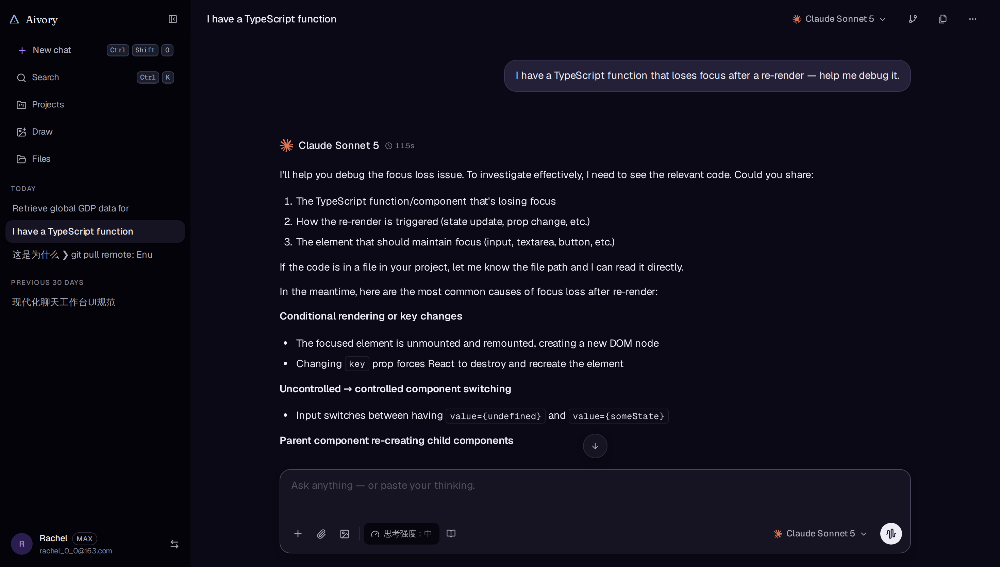
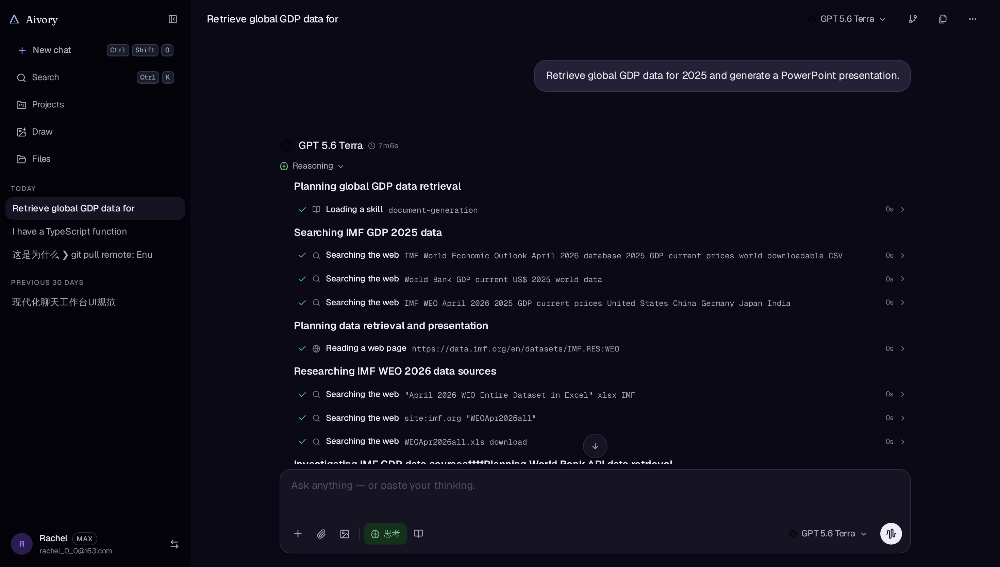
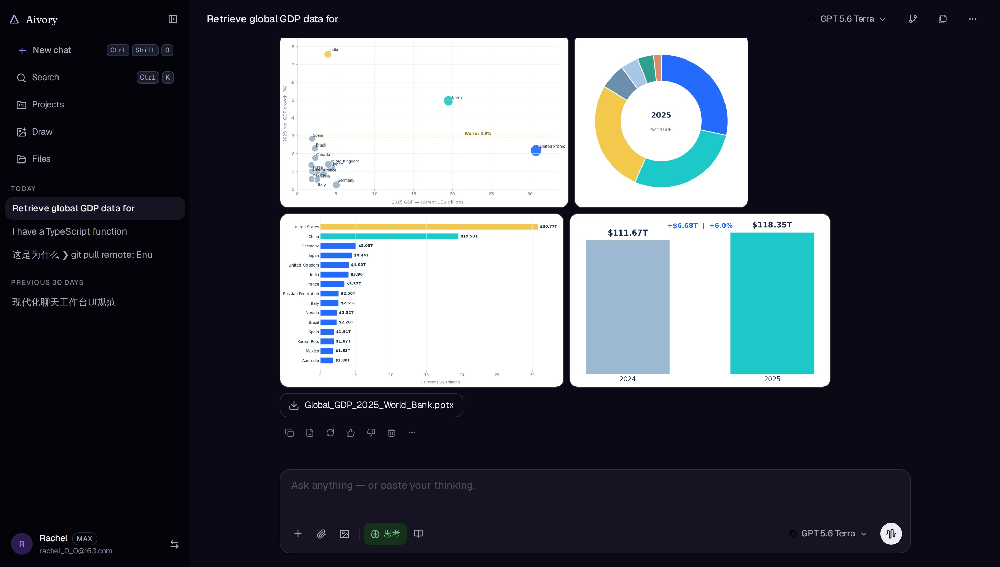
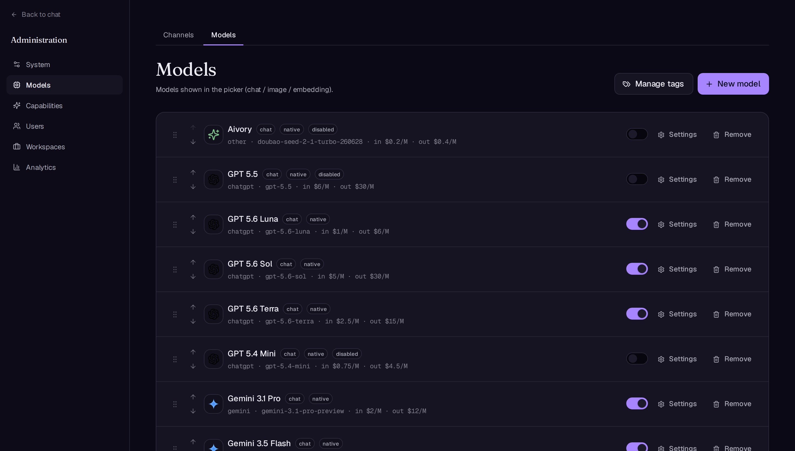
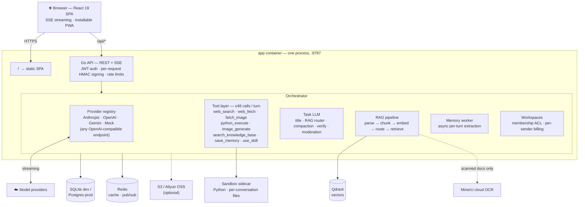

# Aivory

<p align="center">
  
</p>

<p align="center">
  <strong>A self-hosted AI chat platform that actually competes with the hosted products.</strong><br>
  Multi-model · Interleaved tool calls · Persistent Python sandbox · RAG · Team workspaces · Deep Research · Full admin backend.
</p>

<p align="center">
  <a href="./README.md"><strong>English</strong></a> ·
  <a href="./README.zh-CN.md">简体中文</a>
</p>

<p align="center">
  <a href="https://github.com/hjxwz123/Aivory/actions/workflows/docker-images.yml"></a>
  <a href="https://github.com/hjxwz123/Aivory/pkgs/container/aivory-app"></a>
  
  
  
  <a href="./LICENSE"></a>
</p>

---

## Why Aivory

Most self-hosted AI frontends are thin proxies — one model, one message, one response. Aivory is built as a production platform: the same depth you expect from Claude.ai or ChatGPT, with the control of running it yourself.

## Feature highlights

| | Feature | What you get |
|---|---|---|
| 🔀 | **Multi-model** | Claude / GPT / Gemini behind one UI; per-message model attribution; tag-filtered picker; any OpenAI-compatible endpoint |
| 🛠 | **Interleaved tool calls** | Up to **48 tool calls across 12 provider cycles in one turn** — search → fetch → compute → plot, chained autonomously; native function calling with a prompt-protocol fallback for models without it |
| 🐍 | **Python sandbox** | Self-hosted sandbox cluster with **per-conversation persistent files**; uploads staged in, artifacts (plots, CSVs) streamed back inline; browser-side Pyodide runner too |
| 📚 | **RAG & knowledge bases** | Query router (intent → full-text / retrieve / none), hierarchical chunking, hybrid retrieval + RRF, similarity-based dynamic top-K, cited answers; text-layer PDFs parse locally in ms, scanned docs go to MinerU OCR |
| 👥 | **Team workspaces** | Fully-isolated shared spaces: invite-link membership, shared conversations/projects/KBs, per-sender billing, author-attributed bubbles, owner moderation, admin oversight |
| 🌳 | **Conversation tree** | Edit/retry creates real branches with `< 2/3 >` switching that never interrupts streaming; draggable outline window with a zoomable node graph; a minimap rail for long chats |
| ✅ | **Verify mode** | A second model adversarially fact-checks each reply and pins structured findings (quote + issue + severity) with a trust badge |
| 🔬 | **Deep Research** | Multi-round plan → search → read → verify pipeline with a live progress panel and cited synthesis |
| 🎨 | **Image generation** | Drawing mode with admin-curated styles, credit metering, a personal gallery, and image models managed like any other channel |
| 🧠 | **Memory** | Async fact extraction across conversations with supersedence tracking — never in shared workspaces (privacy) |
| 📦 | **Projects & skills** | Project containers with shared libraries + instructions; admin-managed skill packs progressively loaded at runtime |
| 🗜 | **Long-context compaction** | Keep-N verbatim + rolling task-model summaries, cache-stable prefixes, inline compaction on real token spikes |
| 💳 | **Credits & tiers** | User groups with timed allowances + permanent credits, per-model quotas, pre-flight cost gating, redeem codes, subscription-page visibility control |
| 🛡 | **Security** | Backend-proxied keys, per-request HMAC signing, capability-token shares/invites, sandboxed HTML preview, upload validation, rate limits everywhere |
| 🌍 | **Polish** | 5 languages (en / 简中 / 繁中 / 日 / fr), installable PWA, mobile-first redesign, light/dark, editorial design system |

---

## Tool calls & Python sandbox

This is where Aivory diverges most from the rest. The orchestrator runs **up to 48 tool calls across 12 provider cycles in a single turn**. Tools chain freely — the output of one call becomes the input for the next, with no manual handoff required.

### Multi-step pipeline in one turn

<p align="center">
  
</p>

The screenshot above shows a single user prompt — *"Retrieve global GDP data for 2025 and generate a PowerPoint presentation"* — triggering a five-step pipeline without any user intervention:

1. `web_search` → IMF World Economic Outlook 2025 nominal GDP by country
2. `web_search` → current IMF GDP projections global total
3. `python_execute` → load and clean the data
4. `web_fetch` → IMF external data page for the top-10 table
5. `python_execute` → build a polished slide deck with python-pptx

<p align="center">
  
</p>

The result: a complete presentation and a data CSV, both available as download cards, with a bar chart rendered inline and 10 sources cited. No intermediate prompts. No "please attach the file." The model drives the whole pipeline.

### How it works

The orchestrator loops through provider cycles until the model stops emitting tool calls or the per-turn budget is reached. Within each cycle, independent tool calls run in parallel; results are fed back as a batch. Files written to `/workspace/` in one call are immediately available to the next:

```
web_search  ─┐
web_search  ─┤→ python_execute (clean data) → web_fetch → python_execute (build .pptx)
             └─ (results merged as one batch)
```

Because the sandbox shares a filesystem session across all calls in the conversation, data from a previous turn is still there when the model comes back minutes later.

### Persistent Python sandbox

Every conversation has its own isolated sandbox container. Files persist between turns — the model can write a CSV in turn 1 and reference it in turn 5. If the sidecar is reaped (container restart, deploy), the runner detects the 404, provisions a fresh session, re-stages all uploaded files, and retries transparently.

- Full Python standard library + pip-installable packages (pandas, matplotlib, python-pptx, …)
- `stdout` / `stderr` stream line-by-line while the code runs — you see progress, not just results
- Exceptions appear inline with the traceback
- Files written to `/workspace/output/` surface as download cards at the end of the message
- Admins can browse and clear any user's sandbox workspace from the inspector panel

### Run code in the browser too

Assistant-generated Python code blocks carry a **Run** button. Click it and Pyodide (CPython compiled to WebAssembly) executes in a Web Worker — the main thread never blocks. `matplotlib` charts render as inline PNGs; the last expression's `repr()` appears below the block.

HTML code blocks open a **live preview panel** alongside the chat as the assistant types — iframe-sandboxed, no same-origin access. Zero backend, zero cost per run.

### Available tools

| Tool | What it does |
|------|--------------|
| `web_search` | Full-text web search via SearXNG (self-hosted) or Serper / Brave |
| `web_fetch` | Fetch and extract a URL — respects robots.txt |
| `fetch_image` | Download a public image into `/workspace/uploads/` for subsequent Python use |
| `python_execute` | Run Python in the persistent sandbox; full stdlib, packages, real file I/O |
| `image_generate` | Call a configured image model and save the result as an artifact |
| `search_knowledge_base` | Hybrid dense + BM25 retrieval with RRF from any attached knowledge base |
| `save_memory` | Persist a user fact for injection in future conversations |
| `use_skill` | Execute an admin-defined skill (prompt + asset bundle) |

Per-turn budget:

| Tool | Standard | Deep Research |
|------|----------|---------------|
| `web_search` | 16 | 40 |
| `web_fetch` | 12 | 25 |
| `fetch_image` | 16 | 12 |
| `image_generate` | 8 | 4 |
| `python_execute` | 16 | 8 |
| **Total calls** | **48** | **150** |

---

## Other features

### Team workspaces

Create a workspace from the avatar menu and share an invite link — members see the same conversations, projects and knowledge bases, completely isolated from everyone's personal space. Anyone can continue any conversation (each sender pays from their own quota); bubbles attribute every question to its author, and only creators can delete their conversations. Owners moderate members and can rotate the invite link or delete the space (cascade). Admins get a dedicated Workspaces page with full drill-down, including read-only transcript viewing.

### Verify mode

Toggle Verify on a turn and a second, admin-configured model audits the primary answer — quoting the exact sentences it disputes, with severity levels, surfaced as a trust badge on the reply ("Verified" or "N issues found").

### Image generation

A dedicated drawing mode with admin-curated style presets: prompts are optimized by a task model, generation is credit-metered per image model, and results land in a personal gallery. Reference images allow edit/variation workflows.

### Conversation branching

Every edit and every regeneration opens a sibling branch — no history is ever overwritten. Navigate branches with `‹ N/M ›` controls on any message, or fork any branch into a new conversation.

The **Conversation Outline** panel (top-right toolbar) gives a bird's-eye view of the whole thread: numbered user questions, truncated to two lines. Click any item to jump there instantly. The panel floats, is draggable, resizable, and zoomable.

### Deep Research mode

A separate multi-round engine: the model generates a research plan, fans out up to **40 web searches and 25 page reads in parallel**, verifies claims across sources, and composes a cited final report. Progress streams live as the plan unfolds — you see what's being searched, not just the finished answer.

### Document QA and RAG

- **Hierarchical chunking**: small-to-big, ~12% overlap, structure-aware (code / tables / math never split mid-block)
- **Heading breadcrumbs** on every chunk so the model always knows context
- **Hybrid retrieval**: Qdrant dense vectors + PostgreSQL BM25, fused with Reciprocal Rank Fusion
- **Query routing**: a task LLM classifies each query — `retrieve`, `full_doc`, or `none` — before retrieval
- **MinerU integration**: scanned PDFs, DOCX, PPTX, XLSX, and images run through cloud OCR; your files stay in your own S3 / Aliyun OSS bucket

### Memory across conversations

After each turn, a background worker extracts durable facts about the user ("prefers terse answers", "based in Tokyo"). On the next conversation, relevant memories are injected into the system prompt automatically. Users manage their own memory store at `/settings/memory`. Extraction runs async — it never slows the response.

### Thinking / chain-of-thought

Native reasoning support for Claude (extended thinking) and Gemini (chain-of-thought). Thinking blocks stream in a collapsible panel above the response so you can follow the model's reasoning without it cluttering the conversation.

---

## Admin backend

<p align="center">
  
</p>

| Section | What you manage |
|---------|-----------------|
| Channels | Provider URL + API key per channel. Multiple channels of the same provider type are allowed. |
| Models | Enable / disable, display name, context window, per-model knobs, Deep Research exposure, image fallback chain, in/out pricing. |
| Model Tags | Admin-defined labels ("Fast", "Vision", "Coding") shown as filter chips in the model picker. |
| User Groups | Named tiers with feature flags — extra tools, higher context, custom branding, group quotas. |
| Users | Role assignment, real-time ban (JWT token-version bump), conversation drill-down (read-only). |
| Skills | Prompt templates + asset bundles callable via `use_skill`. |
| Usage | Per-user, per-model, per-purpose (chat / task / image / embedding) usage and cost reports. |
| Knowledge Bases | Per-account KBs with document management and embedding status. |
| Settings | Sandbox, S3/OSS, SearXNG, upload allowlist, MinerU, compaction — all live-reloaded, no restart. |
| Backup | Full logical backup (every table as JSONL in a ZIP, optional bundled files). SQLite ↔ PostgreSQL portable. |
| Sandbox Inspector | Browse and clear files in any user's sandbox workspace. |

Every setting takes effect on the next request — no restart, no SSH.

---

## Quick start

Requires Docker 24+ with the Compose plugin.

```bash
# 1. Clone
git clone https://github.com/hjxwz123/Aivory.git
cd Aivory/deploy

# 2. Fill in secrets
cp .env.example .env
$EDITOR .env   # set POSTGRES_PASSWORD, REDIS_PASSWORD, JWT_SECRET

# 3. Pull prebuilt images and start
docker compose -f docker-compose.prod.yml pull
docker compose -f docker-compose.prod.yml up -d
```

Open `http://localhost`. The setup screen appears on first launch — the first account you create becomes the administrator. Go to `/admin/channels` to add a provider key and create a model.

Five containers come up:

| Container | Image | Role |
|-----------|-------|------|
| `postgres` | `postgres:16-alpine` | Users, conversations, KBs, settings, usage |
| `redis` | `redis:7-alpine` | Cache, rate limits, kill-signal pub/sub |
| `qdrant` | `qdrant/qdrant:v1.12.4` | Vector search for RAG |
| `sandbox` | `ghcr.io/hjxwz123/aivory-sandbox-sidecar:latest` | Bundled code-execution sandbox (internal-only) |
| `app` | `ghcr.io/hjxwz123/aivory-app:latest` | One container: Go HTTP + SSE server **and** the built SPA, same origin |

Postgres / Redis / Qdrant use named volumes (`pgdata`, `redisdata`, `qdrantdata`). Uploads and artifacts are bind-mounted from `DATA_DIR` (default `./data`) — files land directly on the host, no container access needed. The admin backup page can also generate an async full migration ZIP that includes DB rows, files, and Qdrant vectors; completed archives live under `BACKUP_DIR` (default `DATA_DIR/backups`).

---

## Local development

The Go API ships with an embedded SQLite driver and a full-context RAG fallback, so everything runs without external services for development. Docker Compose still starts Qdrant by default for production-like vector retrieval.

```bash
# Backend
cd server
go run ./cmd/api          # listens on :8787

# Frontend (separate terminal)
cd ..
npm install
npm run dev               # Vite at :5173, proxies /api to :8787
```

Open `http://localhost:5173`. First launch shows the setup screen.

---

## Architecture



> Everything admin-configurable hot-reloads — providers, models, tools, RAG, storage — no restarts.


---

## Configuration

Most of Aivory is configured from the admin UI at runtime — provider keys, MinerU token, S3 credentials, SearXNG URL, upload allowlist, disabled tools, compaction settings. All apply on the next request, no restart needed.

The env file only holds boot-time essentials:

| Group | Keys | Purpose |
|-------|------|---------|
| **Image** | `IMAGE_OWNER`, `IMAGE_TAG` | GHCR namespace / tag to pull |
| **Network** | *(none)* | App serves SPA + `/api` on one origin; host port is the `80:8787` mapping in compose. No domain/CORS env. |
| **Postgres** | `POSTGRES_USER/PASSWORD/DB` | Database credentials |
| **Redis** | `REDIS_PASSWORD` | Cache auth |
| **Auth** | `JWT_SECRET` | Required; ≥ 32 chars |
| **Data** | `DATA_DIR`, `BACKUP_DIR`, `MAX_BACKUP_BYTES` | Host directory for uploads/artifacts, async admin backup archives, and import size cap |
| **Sandbox** | `SANDBOX_BASE_URL`, `SANDBOX_API_KEY` | Python sandbox sidecar (optional) |
| **Boot fallbacks** | `SEARCH_*`, `EMBEDDING_*`, `MINERU_*` | Used when the matching admin setting is absent |

### Advanced tuning (optional)

Beyond the boot-time keys above, every internal timeout, concurrency limit, retry/backoff, batch size, cache TTL, and similar tuning knob is also overridable via environment variable — see **[`docs/config-reference.md`](docs/config-reference.md)** (Chinese: [`docs/config-reference.zh-CN.md`](docs/config-reference.zh-CN.md)) for the full list with defaults and locations.

These are intentionally **not** listed in `.env.example` — leave it alone unless you actually need one. Every variable defaults to the current hardcoded value, so Aivory's behavior is unchanged if you set none of them. If you need one, copy it from the reference doc into your own `.env`:

- Backend (Go) vars take effect on the next `aivory-api` restart.
- `VITE_*` frontend vars are inlined at **build time** — set them before `npm run build` / the frontend Docker build, not at container runtime.
- `SANDBOX_*` vars belong to the `sandbox-service` process and take effect on its restart.

---

## Tech stack

- **Frontend**: React 19, TypeScript 5, Vite 5, Tailwind 4, Radix UI, Zustand, i18next, lucide-react
- **Backend**: Go 1.22, standard `net/http`, hand-rolled typed queries
- **Storage**: PostgreSQL 16 (production) / SQLite (embedded dev fallback)
- **Cache & coordination**: Redis 7
- **Vector search**: Qdrant 1.12 (full-context fallback when no vector backend is configured)
- **Document parsing**: MinerU cloud API (PDF / DOCX / PPTX / images via OCR)
- **Internationalization**: 5 locales — English, Simplified Chinese, Traditional Chinese, Japanese, French

---

## Project layout

```
.
├── src/                      React SPA
│   ├── pages/                chat · admin · kb · memory · projects · settings
│   ├── components/           chat primitives, UI system, sidebar
│   ├── store/                Zustand stores (conversations, models, UI, …)
│   └── styles/               Tailwind tokens + global CSS
├── server/                   Go API
│   ├── cmd/api/              main entrypoint
│   └── internal/
│       ├── api/              HTTP handlers, router, upload safety
│       ├── llm/              Provider adapters + orchestrator + task LLM + memory worker
│       ├── tools/            All 8 built-in tools
│       ├── rag/              parse → chunk → embed → query-route → retrieve
│       ├── vector/           Qdrant client (+ PG fallback)
│       ├── store/            Schema + typed queries (SQLite / PostgreSQL)
│       ├── sandbox/          HTTP client for the Python sandbox sidecar
│       └── storage/          S3 / OSS presign client
├── deploy/                   Production Docker stack
│   ├── docker-compose.prod.yml
│   ├── Dockerfile.app          Multi-stage: SPA build + Go build → one runtime
│   └── .env.example
└── docs/screenshots/         Screenshots referenced in this README
```

---

## GitHub Actions

| Workflow | Trigger | Output |
|----------|---------|--------|
| `docker-images.yml` | push to `main`, `v*.*.*` tags, manual dispatch | `ghcr.io/<owner>/aivory-app` — multi-arch (amd64 + arm64) |

- `main` → `:latest` + `:sha-<short>`
- `v1.2.3` → `:1.2.3` + `:1.2` + `:1` + `:latest`

The workflow only needs `GITHUB_TOKEN`.

---

## Contributing

Open an issue first for non-trivial changes. Before submitting a PR:

```bash
# Frontend
npm run lint && npm run typecheck && npm run build

# Backend
cd server && go vet ./... && go build ./...
```

---

## License

[Apache 2.0](./LICENSE) — you may use, modify, and distribute this software, including in proprietary/closed-source products, provided you retain the original copyright notice, include a copy of this license, and note any modifications you make.

---

## Acknowledgements

[MinerU](https://mineru.net) · [Qdrant](https://qdrant.tech) · [SearXNG](https://github.com/searxng/searxng) · [Radix UI](https://www.radix-ui.com)
