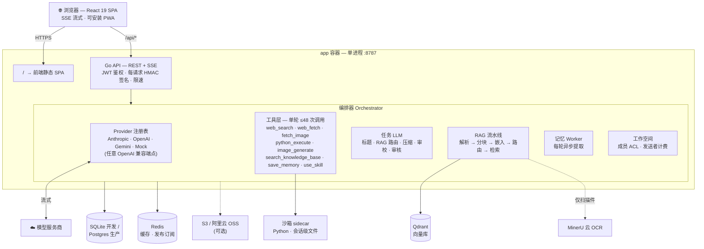

# Aurelia

> 5 分钟自部署、厂商中立的多模型 AI 对话平台。Claude、GPT、Gemini、各种开源模型，统一在一套有编辑感的 UI 下：流式输出、多轮工具调用、RAG、团队工作空间、深度研究、完整管理后台——全是标配。

<p align="center">
  <a href="./README.md">English</a> ·
  <a href="./README.zh-CN.md"><strong>简体中文</strong></a>
</p>

<p align="center">
  <a href="https://github.com/hjxwz123/Aurelia/actions/workflows/docker-images.yml"></a>
  <a href="https://github.com/hjxwz123/Aurelia/pkgs/container/aurelia-app"></a>
  
  
  
  <a href="./LICENSE"></a>
</p>

---

## Aurelia 有什么不一样

大多数自部署聊天前端只是一个薄代理：把请求转发给 API，把流式文本推回来。Aurelia 在真正重要的地方走得更远。

**多轮工具穿插调用** — 模型的工具循环单次最多执行 48 次工具调用（12 个 provider 循环）。来自完全不同领域的工具可以在同一条用户消息里自由串联。典型场景：模型先调 `image_generate` 生成图表，再调 `python_execute` 把图表塞进 PowerPoint 幻灯片——当 Python 代码运行时，生成的图片已经在 `/workspace/uploads/` 里等着了，不需要用户做任何中间操作。一个工具产出的每一个产物，都会自动暂存进沙箱文件系统，供下一个工具读取，让模型真正变成多步骤流水线，而不是一问一答。

**隔离 Python 沙箱** — 每个对话拥有独立的沙箱容器。Python 代码可以使用完整标准库、安装第三方包、读取暂存文件、写出产物并流式传回前端。沙箱 session 在对话生命周期内持久保存（容器被回收后自动恢复），后续消息可以读取之前轮次写入的文件——这是一个真正的有状态计算环境，与聊天并行运行。

**对话树，不是线性日志** — 编辑历史问题、重新生成回答、换模型重试，每次操作都开一个新分支，通过 `< 2/3 >` 控件切换。数据库保留完整树形结构；发给模型的上下文按需压缩历史摘要，不影响原始存档。

**无需重启的管理后台** — 渠道、模型、技能、用户、用量报表、所有系统设置，全部在一流的管理 UI 里操作。任何改动保存后，下一次请求立即生效，无需重启。渠道 API key 存在数据库里，不放 env 文件，轮换密钥不用碰宿主机。

---

## 功能一览表

| | 功能 | 你能得到什么 |
|---|---|---|
| 🔀 | **多模型** | Claude / GPT / Gemini 一套 UI 任意切换，按消息记录所用模型；标签筛选选择器；任意 OpenAI 兼容端点 |
| 🛠 | **多轮工具穿插** | 单轮最多 **48 次工具调用（12 个 provider 循环）**——搜索 → 抓取 → 计算 → 绘图自主串联；原生 function calling + 提示词协议双模式 |
| 🐍 | **Python 沙箱** | 自建沙箱集群,**会话级持久文件**;上传自动暂存、产物(图表/CSV)内联流式回传;浏览器端 Pyodide 也能跑 |
| 📚 | **RAG 与知识库** | 查询路由(意图 → 全文/检索/跳过)、层级分块、混合检索 + RRF、按相似度动态 Top-K、带引用作答;文字层 PDF **本地毫秒级解析**,扫描件才走 MinerU OCR |
| 👥 | **团队工作空间** | 完全隔离的共享空间:邀请链接加入、共享对话/项目/知识库、**谁发送谁计费**、气泡按作者归属、创建者管理成员、管理端全程可查 |
| 🌳 | **对话树** | 编辑/重试开真分支,`< 2/3 >` 切换且不打断流式;可拖拽缩放的概述节点图;长对话右缘侧边预览条秒级定位 |
| ✅ | **多模型互审(Verify)** | 第二个模型对回答做对抗式核查,逐句引用+严重级别的结构化 findings + 信任徽章 |
| 🔬 | **深度研究** | 计划 → 搜索 → 精读 → 校验的多轮流水线,实时进度面板 + 带引用综述 |
| 🎨 | **图片生成** | 绘图模式 + 管理员风格库,按张计积分,个人画廊,参考图编辑/变体 |
| 🧠 | **跨对话记忆** | 每轮异步提取用户事实,自动失效判定;共享工作空间中完全关闭(隐私) |
| 📦 | **项目与技能** | 项目容器(共享库+项目指令);管理员技能包运行时渐进加载 |
| 🗜 | **长上下文压缩** | 保留 N 轮原文 + 任务模型滚动摘要,前缀缓存友好;真尖峰同轮 inline 压缩 |
| 💳 | **积分与用户组** | 定时额度+永久积分、按模型配额、发送前费用预检、兑换码、订阅页展示开关 |
| 🛡 | **安全** | API key 全后端代理、每请求 HMAC 签名、能力令牌分享/邀请、HTML 沙箱预览、上传校验、全面限速 |
| 🌍 | **体验** | 5 语言(简中/繁中/EN/日/法)、可安装 PWA、移动端重做、明暗主题、编辑感设计系统 |

---

## 功能全览

### 工具与流水线

| 工具 | 功能 |
|------|------|
| `web_search` | 通过 SearXNG（自部署）或任何 Serper 兼容后端进行全文网络搜索。 |
| `web_fetch` | 抓取指定 URL 并提取正文，遵守 robots.txt 与内容安全过滤。 |
| `fetch_image` | 把公网图片下载到 `/workspace/uploads/`，供 `python_execute` 嵌入使用。 |
| `python_execute` | 在隔离沙箱中运行任意 Python 代码。支持完整标准库、pip 安装包、文件 I/O。 |
| `image_generate` | 调用配置的图像模型（Gemini Imagen、OpenAI DALL-E 等）生成图片并保存为产物。 |
| `search_knowledge_base` | 对挂载的知识库执行混合密集向量 + BM25 检索，RRF 融合排序。 |
| `save_memory` | 把一条事实写入用户记忆库，后续对话会自动注入。 |
| `use_skill` | 执行管理员预定义的技能（提示词模板 + 资产包）。 |

所有工具的进度均通过 SSE 事件流实时推送，用户可以看到每一步在做什么，而不是盯着空白等最终答案。

### 多轮工具穿插调用——完整原理

编排器驱动一个内层循环，每轮对话最多执行 **48 次工具调用**，跨 **12 个 provider 循环**（提示词模式为 6 个）。每个循环结束后，所有工具结果——包括 `image_generate` 生成的产物、`fetch_image` 下载的图片、之前 `python_execute` 写入 `/workspace/` 的文件——都对下一次工具调用可见。

**自动文件暂存机制**：每次 `python_execute` 调用前，工具运行器把以下内容全部暂存到 `/workspace/uploads/`：

1. 用户在本对话中上传的所有文件（表格、CSV、PDF、图片——每个最大 20 MB）。
2. 本对话中 `image_generate` 生成的所有图片产物。
3. 用户有权限使用的所有技能资产，位于 `/workspace/skills/<name>/`。

因此，如下工作流可以无缝完成：

```
用户："分析 data.csv，生成柱状图，再制作一份包含该图表的幻灯片。"

第 1 轮（单次 Send）
  python_execute: 读 /workspace/uploads/data.csv → 输出分析结果
  image_generate: 渲染柱状图 → 产物保存
  python_execute: /workspace/uploads/chart.png 已就位 → python-pptx 生成 slide.pptx
  → 产物 slide.pptx 流式传输到浏览器
```

全程由模型端到端驱动，用户无需任何中间步骤。

每轮工具调用预算上限（防止滥用和成本失控）：

| 工具 | 普通模式上限 | 深度研究模式 |
|------|-------------|--------------|
| `web_search` | 16 | 40 |
| `web_fetch` | 12 | 25 |
| `fetch_image` | 16 | 12 |
| `image_generate` | 8 | 4 |
| `python_execute` | 16 | 8 |
| **全工具合计** | **48** | **150** |

### Python 沙箱

沙箱是一个 HTTP sidecar 服务（`SANDBOX_BASE_URL`）。配置后：

- 每个对话持有一个持久的 session ID，存储在数据库中。该对话的沙箱容器在多轮对话间保持存活。
- 若上游回收器杀掉了空闲容器，`python_execute` 会检测到 404，重新创建 session、重新暂存所有文件，然后透明重试——用户看不到任何错误。
- 代码输出（stdout、stderr、异常）实时流式返回。
- 写入 `/workspace/output/` 的文件变成产物，以下载卡片形式出现在聊天界面。
- 管理员可以通过 `/admin/sandbox` 沙箱检查器浏览和清理对话的工作区文件。

未配置沙箱 URL 时，`python_execute` 进入安全模式，只执行简单算术——适合开发调试和演示。

### 团队工作空间

在头像菜单里创建工作空间,把邀请链接发给同伴即可加入——空间内的对话、项目、知识库对全体成员共享,与每个人的个人空间**完全隔离**。任何成员都能续聊任何对话(**各自消耗自己的额度**);气泡按作者归属(自己在右,他人+AI 在左,带头像昵称);只有创建者能删自己的对话。空间创建者可踢人、重置邀请链接、删除整个空间(级联清空全部内容);切换的空间选择在本地持久化,重开浏览器仍在原空间。管理端有独立「工作空间」菜单,可钻取成员/对话/项目/知识库,对话可直接点开查看完整聊天记录。

### 多模型互审(Verify)

逐回合开启后,由管理员配置的第二个模型对主回答做**对抗式事实核查**:逐句引用有问题的原文、给出问题描述和严重级别,以「已审校 / 发现 N 处问题」信任徽章展示在回复上。

### 图片生成与画廊

独立绘图模式:提示词先经任务模型润色,按图片模型逐张计积分;管理员维护风格预设库;生成结果进入个人画廊,支持参考图的编辑/变体工作流。

### 对话树与分支管理

每次编辑问题或重新生成回答，都在树中创建一个兄弟节点，而非覆盖历史。用户可以：

- 通过助手消息上的 `< N/M >` 控件在分支间切换。
- **安全删除一轮对话**（包含用户提问和所有对应的助手回答）——删除操作感知分支：其他分支和后续所有消息不受任何影响。
- 用不同模型重新生成——分支对比直观呈现两个回答。

数据库存储完整树。编排器只沿活跃路径组装上下文，按可配置水位线（`keep_recent_rounds`）把窗口外的旧轮次压缩成摘要块，不修改原始存档。

### RAG 与文档问答

- **层级化切块**：small-to-big，~12% 重叠，结构感知（代码块 / 表格 / 数学公式整块保留，不切断）。
- **标题路径前缀**：每个分块都带有从根到当前位置的标题面包屑，模型始终知道片段来自哪里。
- **混合检索**：Qdrant 密集向量 + Postgres BM25 关键词检索，RRF 融合排序。
- **查询路由**：任务 LLM 在检索前把每个查询分类为 `retrieve`、`full_doc` 或 `none`，并为多向量搜索改写查询。
- **MinerU 集成**：扫描件 PDF / DOCX / PPTX / XLSX / 图片通过 MinerU 云端 OCR API 解析。原文件落在你自己的 S3 / 阿里云 OSS 桶，MinerU 只拿到预签名 URL，凭据不出域。

### 深度研究模式

独立的多轮研究引擎（`deep_research.go`）：模型生成研究计划，并行发出最多 40 次网络搜索和 25 次页面抓取，验证断言，最终生成带引用的完整报告。该模式下工具预算大幅提升。

### 记忆管理

每轮对话结束后，后台 worker 用任务 LLM 自动提取候选记忆。记忆按固定槽位存储（Tier 0），分 ACTIVE 和 QUERY_DEPENDENT 两类。ACTIVE 记忆注入每次系统提示；QUERY_DEPENDENT 记忆在上下文中按需判决。用户在 `/memory` 页面管理自己的记忆库。

### 知识库

每个账号可创建多个知识库。每个知识库支持文件上传（文本 / PDF / DOCX / XLSX / 图片）、状态跟踪（pending → parsing → embedding → ready）、按文档管理。在对话中挂载知识库后，可通过 `search_knowledge_base` 工具检索。

### 管理后台

| 模块 | 管理内容 |
|------|---------|
| 渠道 | 每个渠道的 Provider base URL + API key；同一类型可配置多个渠道。 |
| 模型 | 启用/禁用、显示名称、上下文窗口、param_controls（每模型 UI 控件，如"深度思考"开关）、深入研究暴露开关、标签、图像模型回退链。 |
| 模型标签 | 管理员创建标签（如"快速"、"多模态"、"编程"）并分配给模型；在模型选择框顶部渲染为筛选芯片。 |
| 技能 | 提示词模板 + 资产包，通过 `use_skill` 工具调用。 |
| 用户 | 角色、用户组/层级分配、基于 token 版本号的实时封禁。 |
| 用量 | 按用户、模型、用途（聊天 / 任务 / 图像 / 嵌入）的用量报表。 |
| 设置 | 沙箱 URL/key、S3/OSS 凭据、SearXNG 地址、上传白名单、禁用工具列表、压缩设置——全部实时生效。 |
| 沙箱检查器 | 浏览和清理指定对话的沙箱工作区文件。 |

### 用户组与层级

每个用户归属一个用户组（管理员管理）。侧边栏底部显示组名，而非通用角色徽章。用户组可携带功能 flag，解锁额外工具访问权限或更高上下文限制。

### 模型选择框与标签筛选

模型选择框顶部显示管理员在"模型标签"页面定义的所有筛选芯片。选中标签，列表自动收窄到仅含该标签的模型。选"全部"显示所有启用的模型。标签顺序和名称由管理员自定义，可以创建"快速"、"多模态"、"推理"等有意义的分类。

### 首次启动初始化

首次启动时没有任何账号。Aurelia 不通过环境变量预置管理员凭据（这是安全反模式），而是展示一个初始化页面，要求输入昵称、邮箱和密码。**第一个创建的账号即为管理员**。后续注册走普通流程。

### 国际化

完整 UI 支持 5 种语言：英语、简体中文、繁体中文、日语、法语。每一个页面、对话框、Toast 提示和错误信息都已翻译，包括管理后台和法律页面。

### 文件上传安全基线

- 按用户独立子目录隔离（多层路径穿越防护）。
- 取最后一个扩展名进行白名单判定——`report.pdf.exe` 被判定为 `.exe`，而非 `.pdf`。
- 拒绝 NUL 与控制字符。
- 管理员可配置 MIME 类型白名单，默认安全集刻意排除可执行文件、归档、HTML/SVG。
- 字节大小上限在写入磁盘前强制检查。

---

## 快速开始（推荐：Docker）

需要 Docker 24+ 与 Compose 插件。

```bash
# 1. 克隆（只需要 deploy/ 子目录）
git clone https://github.com/hjxwz123/Aurelia.git
cd Aurelia/deploy

# 2. 填密钥
cp .env.example .env
$EDITOR .env             # 至少改 POSTGRES_PASSWORD、REDIS_PASSWORD、JWT_SECRET

# 3. 拉镜像 + 启动
docker compose -f docker-compose.prod.yml pull
docker compose -f docker-compose.prod.yml up -d
```

完成后访问 `http://localhost`（默认映射主机 80 端口；如被占用，改 `docker-compose.prod.yml` 里的 `"80:8787"` 映射即可，无需任何环境变量）。前端与 `/api` 同源,**解析到哪个域名哪个域名就能用**,不需要配 `PUBLIC_ORIGIN` / `ALLOWED_ORIGINS`。

**首次启动**：进入初始化页面，填写昵称、邮箱和密码，该账号成为管理员。随后去 `/admin/channels` 添加第一个 Provider key，并创建模型。

五个容器：

| 容器 | 镜像 | 作用 |
|------|------|------|
| `postgres` | `postgres:16-alpine` | 用户、对话、知识库、设置、用量记录 |
| `redis` | `redis:7-alpine` | 缓存、限频计数器、kill-signal pub/sub |
| `qdrant` | `qdrant/qdrant:v1.12.4` | RAG 向量检索 |
| `sandbox` | `ghcr.io/hjxwz123/aurelia-sandbox-sidecar:latest` | 内置代码执行沙箱（仅内网） |
| `app` | `ghcr.io/hjxwz123/aurelia-app:latest` | 单容器：Go HTTP + SSE 服务 **同时**托管前端 SPA，同源 |

**数据持久化**：Postgres / Redis / Qdrant 数据落在命名卷（`pgdata` / `redisdata` / `qdrantdata`）。上传文件和生成产物绑定挂载到**宿主机**目录（`DATA_DIR`，默认 `./data`），文件直接落在宿主机文件系统，不进容器，方便查看与备份。备份时把命名卷和 `DATA_DIR` 一起打包，保证数据库行、向量和磁盘文件三者一致。管理员后台也可以异步生成全量迁移 ZIP，包含数据库行、文件和 Qdrant 向量；生成后的归档位于 `BACKUP_DIR`（默认 `DATA_DIR/backups`）。

---

## 架构图



> 所有管理端配置(渠道、模型、工具、RAG、存储)保存即生效,全程无需重启。


---

## 配置

Aurelia 的绝大多数配置项**通过管理后台实时改**，不依赖环境变量。Provider key、MinerU token、S3 凭据、SearXNG 地址、上传白名单、禁用工具列表——全在 admin 页面编辑，保存后下一次请求即生效，无需重启。

[`deploy/.env.example`](./deploy/.env.example) 里只放了启动必需的少量项：

| 分组 | 键 | 用途 |
|------|----|----|
| **镜像** | `IMAGE_OWNER`、`IMAGE_TAG` | 从哪个 GHCR 命名空间拉镜像 / 拉哪个 tag |
| **网络** | *（无）* | 前端与 `/api` 同源，任意域名自适应；主机端口在 compose 的 `80:8787` 映射里改，无需域名/CORS 变量 |
| **Postgres** | `POSTGRES_USER/PASSWORD/DB` | 数据库凭据 |
| **Redis** | `REDIS_PASSWORD` | 必填，启用 `requirepass` |
| **Qdrant** | `QDRANT_API_KEY` | 可选 API key |
| **鉴权** | `JWT_SECRET` | 必填，≥32 字符；生产环境拒绝 dev 默认值 |
| **数据目录** | `DATA_DIR`、`BACKUP_DIR`、`MAX_BACKUP_BYTES` | 绑定挂载到 `/app/data` 的宿主机目录、异步后台备份归档位置，以及备份导入大小上限 |
| **启动兜底** | `SEARCH_*`、`EMBEDDING_*`、`MINERU_*` | 只在对应 admin 设置项为空时生效 |
| **沙箱** | `SANDBOX_BASE_URL`、`SANDBOX_API_KEY` | 连接 Python 沙箱 sidecar（可选；不配则安全模式） |

> 不再通过环境变量预置管理员账号——首次启动经初始化页面创建的第一个账号即为管理员。

---

## 从源码自行构建镜像

```bash
cd deploy
cp .env.example .env
docker compose -f docker-compose.prod.yml up -d --build
```

`api` 与 `web` 服务都同时声明 `image:` 和 `build:`，Compose 优先用已有镜像，缺了就本地构建。

---

## 本地开发（不用 Docker）

Go API 自带 SQLite 驱动 + 哈希袋兜底嵌入器，不装任何外部服务就能跑起来。

```bash
# 后端
cd server
go run ./cmd/api                  # 监听 :8787

# 前端（另开终端）
cd ..
npm install
npm run dev                       # Vite :5173，代理 /api → :8787
```

打开 `http://localhost:5173`，首次启动进入初始化页面——创建的第一个账号（昵称 + 邮箱 + 密码）即为管理员。随后在 `/admin` 配置渠道与模型即可开始聊天。

---

## GitHub Actions：自动构建镜像

| Workflow | 触发条件 | 产物 |
|----------|---------|------|
| **`docker-images.yml`** | push 到 `main`、`v*.*.*` tag、手动 dispatch | `ghcr.io/<owner>/aurelia-app`——多架构（amd64 + arm64） |

打 tag 规则：

- push 到 `main`    → `:latest` + `:sha-<short>`
- push tag `v1.2.3` → `:1.2.3` + `:1.2` + `:1` + `:latest`
- pull request      → 只构建，不推送（冒烟测试）

workflow 只需要 `GITHUB_TOKEN`（GitHub 自动注入）。首次成功跑完后，repo 的 Packages 侧栏会出现 `aurelia-app`。Fork 后记得把 `deploy/.env` 里的 `IMAGE_OWNER` 改成你的小写 GitHub 用户名。

---

## 技术栈

- **前端**：React 19、TypeScript 5、Vite 5、Tailwind 4、Radix UI、Zustand、i18next、lucide-react
- **后端**：Go 1.22、标准 `net/http`、手写 sqlc 风格查询
- **存储**：PostgreSQL 16（生产）/ SQLite（嵌入式开发兜底）
- **缓存与协调**：Redis 7
- **向量检索**：Qdrant 1.12（未配置向量后端时使用全文上下文兜底）
- **文档解析**：MinerU 云 API（PDF / DOCX / PPTX / 图片 OCR）
- **可选**：S3 / 阿里云 OSS 作源文件桶，SearXNG 作自部署搜索引擎

---

## 项目结构

```
.
├── src/                      React 前端（对话 / 后台 / KB / 记忆 / 项目）
├── server/                   Go 后端
│   ├── cmd/api/              main 入口
│   └── internal/
│       ├── api/              HTTP handler、路由、上传安全
│       ├── llm/              Provider 适配 + 编排器 + 任务 LLM + 记忆 Worker
│       ├── tools/            web_search / web_fetch / fetch_image / python_execute /
│       │                     image_generate / search_knowledge_base / save_memory / use_skill
│       ├── rag/              解析 → 切块 → 嵌入 → 查询路由 → 检索
│       ├── vector/           Qdrant 客户端（+ PG 兜底）
│       ├── store/            Postgres / SQLite 表结构与查询
│       ├── sandbox/          Python 沙箱 sidecar 的 HTTP 客户端
│       └── storage/          S3 / OSS 上传 + 预签名 HTTP 客户端
├── deploy/                   生产部署
│   ├── docker-compose.prod.yml
│   ├── Dockerfile.app        多阶段：Vite 构建 + Go 构建 → 单运行时（同源托管前端 + /api）
│   └── .env.example          环境变量模板
├── docs/                     设计笔记、规约
└── .github/workflows/        镜像构建 CI
```

---

## 参与贡献

欢迎 PR。改动较大请先开 issue 讨论形态，避免做完再返工。

push 前本地自测：

```bash
# 前端
npm run lint
npm run typecheck
npm run build

# 后端
cd server
go vet ./...
go build ./...
```

---

## 开源协议

[Apache 2.0](./LICENSE)——允许商用、修改、闭源二次分发，但须保留原始版权声明、附带本协议副本，并在修改的文件中注明变更。

---

## 致谢

- [MinerU](https://mineru.net) 提供文档解析云服务。
- [Qdrant](https://qdrant.tech) 提供向量数据库。
- [SearXNG](https://github.com/searxng/searxng) 提供自部署元搜索引擎。
- Radix UI / shadcn 的无头组件生态，Aurelia 在其之上重新主题化。
